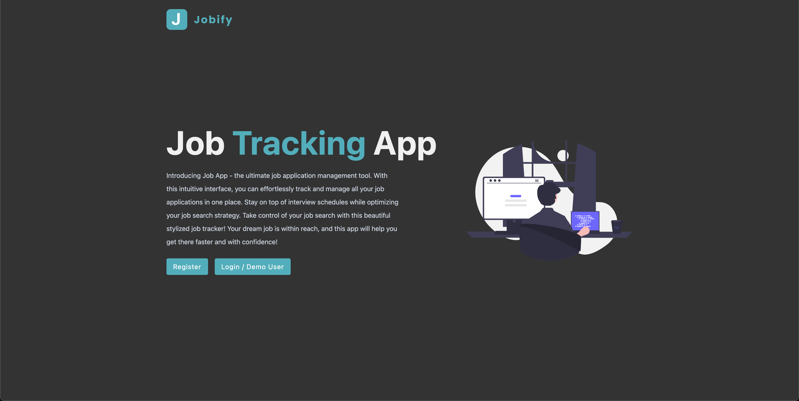
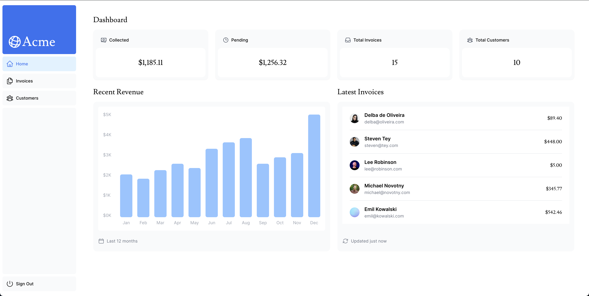
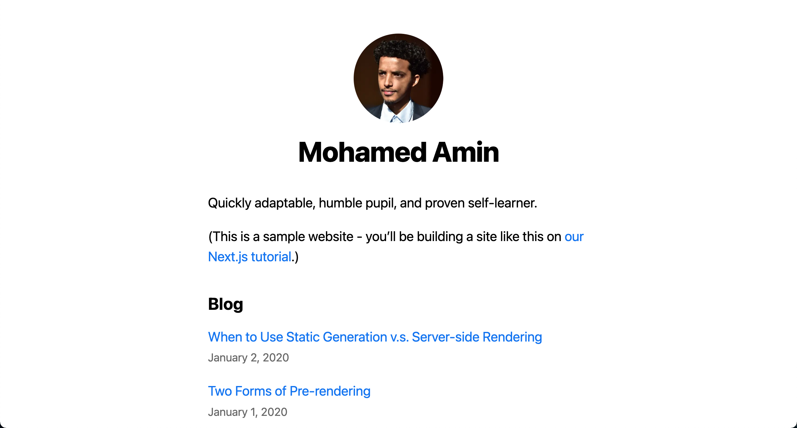
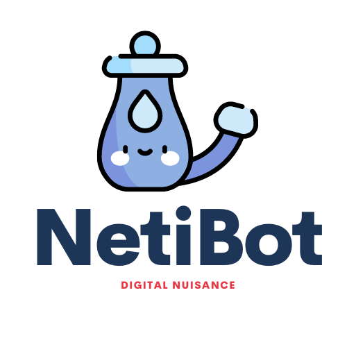

# My Portfolio

## Introduction

This portfolio showcases some of my projects and skills.

## Table of Contents

- [About Me](#about-me)
- [Projects](#projects)
- [Skills](#skills)
- [Contact](#contact)

## About Me

Passionate about software engineering and full-stack development, I am a results-driven professional with experience in building high-quality mobile and web applications. With a strong foundation in JavaScript, React, and Node.js, I thrive in collaborative environments, leveraging my skills to create innovative solutions. I am motivated by challenges and dedicated to delivering exceptional user experiences. Let's connect and explore opportunities to contribute to exciting projects together!

## Projects

### Project 1: Job Tracking App

- **Description**: Take control of your job search with this beautiful stylized job tracker!
- **GitHub Repository**: [GitHub Link](https://github.com/taha-amin/job-app-v2)
- **Live Application**: [Application Link](https://applyzen.onrender.com)

### Project 2: Financial Dashboard

- **Description**: A simplified financial dashboard built using NextJS and hosted on Vercel.
- **GitHub Repository**: [GitHub Link](https://github.com/taha-amin/nextjs-dashboard)
- **Live Demo**: [Demo Link](https://nextjs-dashboard-lemon-five.vercel.app/)
- **Credentials for Access**:

  - **Email**: user@nextmail.com
  - **Password**: 123456

  ### Project 3: Blog

- **Description**: This project is a simple blog application built with Next.js to demonstrate its basic features, including static site generation and dynamic routing.
- **GitHub Repository**: [GitHub Link](https://github.com/taha-amin/nextjs-blog)
- **Invite Link**: [Live Site](https://nextjs-blog-mu-snowy-13.vercel.app/)

### Project 4: NetiBot

- **Description**: Dynamic and entertaining Discord bot designed to enhance your server with a variety of fun & interactive commands.
- **GitHub Repository**: [GitHub Link](https://github.com/NetiBot/NetiBotApp)
- **Invite Link**: [Invite Link](https://discord.com/api/oauth2/authorize?client_id=997611125887733923&permissions=8&scope=bot%20applications.commands)

## Skills

- **Languages**: JavaScript, TypeScript, HTML, CSS
- **Frameworks & Libraries**: React, Node.js, Express.js, Next.js
- **Developer Tools**: Git, Docker, Webpack, etc.
- **Databases**: PostgreSQL, MongoDB, Supabase

## Contact

Feel free to reach out to me via:

- **Email**: [mohamedamin2009ster@gmail.com](mailto:mohamedamin2009ster@gmail.com)
- **LinkedIn**: [/in/mohaamin](https://www.linkedin.com/in/mohaamin/)
- **GitHub**: [GitHub](https://github.com/taha-amin)
